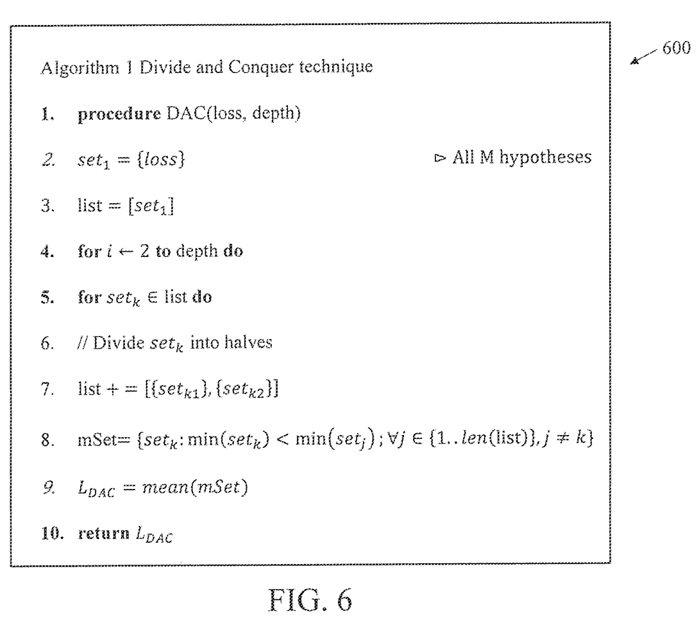

I am a Ph.D. student in the <a href="https://www.ri.cmu.edu/">Robotics Institute</a> at the School of Computer Science, Carnegie Mellon University, advised by <a href="http://www.cs.cmu.edu/~srinivas/">Prof. Srinivasa Narasimhan</a>. My research focuses on computer vision and imaging, exploring modalities beyond the visible spectrum to enable new imaging capabilities. I am currently focused on developing novel algorithms that leverage heat transport and light transport to infer shape, material properties, and scene semantics.

Prior to starting my Ph.D., I was a Research Scholar at NEC Laboratories America, where I worked in the <a href="http://www.nec-labs.com/research-departments/media-analytics/media-analytics-home">Media Analytics</a> department with <a href="https://cseweb.ucsd.edu/~mkchandraker/">Prof. Manmohan Chandraker</a> on problems related to trajectory prediction and Embodied AI.

Earlier in my academic journey, I was affiliated with the Robotics Research Center, collaborating with <a href="https://www.iiit.ac.in/people/faculty/mkrishna/">Prof. K. Madhava Krishna</a> on various robotics-related projects. During the summer of 2017, I interned at IIIT Delhi under the mentorship of <a href="https://sites.google.com/view/sanjitkkaul/">Prof. Sanjit Kaul</a>, where I developed a self-driving vehicle prototype, an experience that sparked my deep interest in robotics.

I am passionate about advancing research and engaging in stimulating discussions on a wide range of topics like, autonomous driving, Embodied AI, imaging and more. Feel free to connect with me at snochurn@cs.cmu.edu.

<b>News</b>

<!--   -->
**07/24:** Paper *Shape from Heat Conduction* accepted to <strong> ECCV 2024 (Oral) </strong>.  
**02/24:** Paper on visible-thermal light transport accepted to CVPR 2024.  
**01/24:** Paper on long-horizon object transport accepted to ICRA 2024.  
**08/22:** Moved to Pittsburgh and started my PhD at <a href="https://www.ri.cmu.edu">RI, CMU</a>.  
**10/21:** Talk on <a href="https://youtu.be/ICSqcqq1sn0?t=120">**Predicting simultaneous multi-hypotheses futures**</a> at Robotics Research Group, IIT BHU 
**02/21:** Paper *Divide and Conquer for Lane-Aware Diverse Trajectory Prediction* is accepted to <strong>CVPR 2021 (Oral)</strong>.  
<!-- **00/21:** Reviewer for CVPR 2021, IROS 2021, ICCV 2021 and CVPR 2022 (Invited)  -->
**07/20:** Paper *SMART: Simultaneous Multi-Agent Recurrent Trajectory Prediction* is accepted to ECCV 2020.  
<!-- **11/19:** Served as a reviewer for ICRA 2020.   -->
**07/19:** Joined NEC Labs America as a Research Scholar.  
**06/19:** Paper *Talk to the Vehicle: Language Conditioned Autonomous Navigation* is accepted at IROS 2019.  
**04/19:** Paper *A Hierarchical Network for Diverse Trajectory Proposals* is accepted at IV 2019.  
**04/19:** Work on shrinking domain based control for planning is accepted at AIR 2019.  

<b>Publications</b>
  

<table style="background-color:#F1F7FC">
  <tr>
    <td style="text-align:left;vertical-align:top;padding-top:1%;padding-left:1%;" width="25%">        </td>
    <td width="70%">    <a href="https://www.cs.cmu.edu/~ILIM/shape_from_heat/"> 
      <strong>Shape from Heat Conduction</strong> </a>   
      <strong>Sriram Narayanan</strong>, Mani Ramanagopal, Mark Sheinin, Aswin C. Sankaranarayanan, Srinivasa G. Narasimhan 
      European Conference on Computer Vision (ECCV), 2024 <strong>(Oral)</strong> 
      <a class="links" href="https://www.cs.cmu.edu/~ILIM/shape_from_heat/" target="_blank"> Project Page </a>
      <a class="links" href="https://www.cs.cmu.edu/~ILIM/shape_from_heat/static/pdfs/shape_from_heat_conduction.pdf" target="_blank"> Paper </a>
      <a class="links" href="https://youtu.be/LM0e8fD18fo?si=ECXXXsxLEGF2r935" target="_blank"> Video </a>
      

        
Thermal cameras measure the temperature of objects based on radiation emitted in the infrared spectrum. In this work, we propose a novel shape recovery approach that exploits the properties of heat transport, specifically heat conduction, induced on objects when illuminated using simple light bulbs. Although heat transport occurs in the entirety of an object's volume, we show a surface approximation that enables shape recovery and empirically analyze its validity for objects with varying thicknesses. We develop an algorithm that solves a linear system of equations to estimate the intrinsic shape Laplacian from thermal videos along with several properties including heat capacity, convection coefficient, and absorbed heat flux under uncalibrated lighting of arbitrary shapes. Further, we propose a novel shape from Laplacian objective that aims to resolve the inherent shape ambiguities by drawing insights from absorbed heat flux images using two unknown lights sources. Finally, we devise a coarse-to-fine refinement strategy that faithfully recovers both low- and high-frequency shape details. We validate our method by showing accurate reconstructions, to within an error of 1-2<i>mm</i> (object size &leq; 13.5<i>cm</i>), in both simulations and from noisy thermal videos of real-world objects with complex shapes and material properties including those that are <i>transparent</i> and <i>translucent</i> to visible light. We believe leveraging heat transport as a novel cue for vision can enable new imaging capabilities.
        

        
      

    </td> 
  </tr>
</table>

<table style="background-color:#F1F7FC">
  <tr>
    <td style="text-align:left;vertical-align:top;padding-top:1%;padding-left:1%;" width="25%">        </td>
    <td width="70%">    <a href="https://arxiv.org/pdf/2502.06973"> 
      <strong> Indoor Light and Heat Estimation from a Single Panorama </strong> </a>   
      Guanzhou Ji, <strong>Sriram Narayanan</strong>, Azadeh Sawyer, Srinivasa G. Narasimhan 
      arXiv, 2025 
      <!-- <a class="links" href="https://imaging.cs.cmu.edu/joint_light_heat_transport/" target="_blank"> Project Page </a> -->
      <a class="links" href="https://arxiv.org/pdf/2502.06973" target="_blank"> Paper </a>
      <!-- <a class="links" href="https://www.youtube.com/watch?v=PFd1IMzoezE" target="_blank"> Video </a> -->
      

        
 This paper presents a novel application for directly estimating indoor light and heat maps from captured indoor-outdoor High Dynamic Range (HDR) panoramas. In our image-based rendering method, the indoor panorama is used to estimate the 3D room layout, while the corresponding outdoor panorama serves as an environment map to infer spatially-varying light and material properties. We establish a connection between indoor light transport and heat transport and implement transient heat simulation to generate indoor heat panoramas. The sensitivity analysis of various thermal parameters is conducted, and the resulting heat maps are compared with the images captured by the thermal camera in real-world scenarios. This digital application enables automatic indoor light and heat estimation without manual inputs and cumbersome field measurements.

        
      

    </td> 
  </tr>
</table>

<table style="background-color:#F1F7FC">
  <tr>
    <td style="text-align:left;vertical-align:top;padding-top:1%;padding-left:1%;" width="25%">        </td>
    <td width="70%">    <a href="https://openaccess.thecvf.com/content/CVPR2024/papers/Ramanagopal_A_Theory_of_Joint_Light_and_Heat_Transport_for_Lambertian_CVPR_2024_paper.pdf"> 
      <strong> A Theory of Joint Light and Heat Transport for Lambertian Scenes</strong> </a>   
      Mani Ramanagopal, <strong>Sriram Narayanan</strong>, Aswin C. Sankaranarayanan, Srinivasa G. Narasimhan 
      Computer Vision and Pattern Recognition (CVPR), 2024 <strong></strong> 
      <a class="links" href="https://imaging.cs.cmu.edu/joint_light_heat_transport/" target="_blank"> Project Page </a>
      <a class="links" href="https://openaccess.thecvf.com/content/CVPR2024/papers/Ramanagopal_A_Theory_of_Joint_Light_and_Heat_Transport_for_Lambertian_CVPR_2024_paper.pdf" target="_blank"> Paper </a>
      <a class="links" href="https://www.youtube.com/watch?v=PFd1IMzoezE" target="_blank"> Video </a>
      

        
We present a novel theory that establishes the relationship between light transport in visible and thermal infrared, and heat transport in solids. We show that heat generated due to light absorption can be estimated by modeling heat transport using a thermal camera. For situations where heat conduction is negligible, we analytically solve the heat transport equation to derive a simple expression relating the change in thermal image intensity to the absorbed light intensity and heat capacity of the material. Next, we prove that intrinsic image decomposition for Lambertian scenes becomes a well-posed problem if one has access to the absorbed light. Our theory generalizes to arbitrary shapes and unstructured illumination. Our theory is based on applying energy conservation principle at each pixel independently. We validate our theory using real-world experiments on diffuse objects made of different materials that exhibit both direct and global components (inter-reflections) of light transport under unknown complex lighting.

        
      

    </td> 
  </tr>
</table>

<table style="background-color:#F1F7FC">
  <tr>
    <td style="text-align:left;vertical-align:top;padding-top:1%;padding-left:1%;" width="25%">        </td>
    <td width="70%">    <a href="https://arxiv.org/pdf/2210.15908.pdf"> 
      <strong> Long-HOT: A Modular Hierarchical Approach for Long-Horizon Object Transport</strong> </a>   
      <strong>Sriram Narayanan</strong>, Dinesh Jayaraman, Manmohan Chandraker 
      International Conference on Robotics and Automation (ICRA), 2024  <strong></strong> 
      <a class="links" href="https://arxiv.org/pdf/2210.15908.pdf" target="_blank"> Paper </a>
      <a class="links" href="https://youtu.be/0f9UpmDfSCs" target="_blank"> Video </a>
      

        
We address key challenges in long-horizon embodied exploration and navigation by proposing a new object transport task and a novel modular framework for temporally extended navigation. Our first contribution is the design of a novel Long-HOT environment focused on deep exploration and long-horizon planning where the agent is required to efficiently find and pick up target objects to be carried and dropped at a goal location, with load constraints and optional access to a container if it finds one. Further, we propose a modular hierarchical transport policy (HTP) that builds a topological graph of the scene to perform exploration with the help of weighted frontiers. Our hierarchical approach uses a combination of motion planning algorithms to reach point goals within explored locations and object navigation policies for moving towards semantic targets at unknown locations. Experiments on both our proposed Habitat transport task and on MultiOn benchmarks show that our method significantly outperforms baselines and prior works. Further, we validate the effectiveness of our modular approach for long-horizon transport by demonstrating meaningful generalization to much harder transport scenes with training only on simpler versions of the task.

        
      

    </td> 
  </tr>
</table>

<table style="background-color:#F1F7FC">
  <tr>
    <td style="text-align:left;vertical-align:top;padding-top:1%;padding-left:1%;" width="25%">        </td>
    <td width="70%">    <a href="https://arxiv.org/abs/2104.08277"> 
      <strong> Divide-and-Conquer for Lane-Aware Diverse Trajectory Prediction</strong> </a>   
      <strong>Sriram Narayanan</strong>, Ramin Moslemi, Francesco Pittaluga, Buyu Liu, Manmohan Chandraker 
      Computer Vision and Pattern Recognition (CVPR), 2021  <strong>(Oral)</strong> 
      <a class="links" href="https://arxiv.org/abs/2104.08277" target="_blank"> Paper </a>
      <a class="links" href="https://www.nec-labs.com/research-departments/media-analytics/blog/Divide-and-Conquer-for-Lane-Aware-Diverse-Trajectory-Prediction" target="_blank"> Blog </a>
      <a class="links" href="https://www.youtube.com/watch?v=PKFggOWN638" target="_blank"> Talk </a>&nbsp; 
      

        <!-- 
We propose a novel multi-choice objective called Divide-And-Conquer (DAC) for diverse future prediction. Our approach acts as a better initialization technique to winner-takes-all objective, resulting in diverse outputs without any spurious modes. Further, we present a novel trajectory prediction framework called ALAN that uses existing lane centerlines as anchors to provide scene consistent predictions
 -->
        
Trajectory prediction is a safety-critical tool for autonomous vehicles to plan and execute actions. Our work addresses two key challenges in trajectory prediction, learning multimodal outputs, and better predictions by imposing constraints using driving knowledge. Recent methods have achieved strong performances using Multi-Choice Learning objectives like winner-takes-all (WTA) or best-of-many. But the impact of those methods in learning diverse hypotheses is under-studied as such objectives highly depend on their initialization for diversity. As our first contribution, we propose a novel Divide-And-Conquer (DAC) approach that acts as a better initialization technique to WTA objective, resulting in diverse outputs without any spurious modes. Our second contribution is a novel trajectory prediction framework called ALAN that uses existing lane centerlines as anchors to provide trajectories constrained to the input lanes. Our framework provides multi-agent trajectory outputs in a forward pass by capturing interactions through hypercolumn descriptors and incorporating scene information in the form of rasterized images and per-agent lane anchors. Experiments on synthetic and real data show that the proposed DAC captures the data distribution better compare to other WTA family of objectives. Further, we show that our ALAN approach provides on par or better performance with SOTA methods evaluated on Nuscenes urban driving benchmark.

        
      

    </td> 
  </tr>
</table>

<table style="background-color:#F1F7FC">
  <tr>
    <td style="text-align:left;vertical-align:top;padding-top:1%;padding-left:1%;" width="25%">        </td>
    <td width="70%">    <a href="https://arxiv.org/pdf/2007.13078.pdf"> 
      <strong> SMART: Simultaneous Multi-Agent Recurrent Trajectory Prediction</strong> </a>   
      <strong>Sriram Narayanan</strong>, Buyu Liu, Francesco Pittaluga, Manmohan Chandraker 
      European Conference on Computer Vision (ECCV), 2020  
      <a class="links" href="https://arxiv.org/pdf/2007.13078.pdf" target="_blank"> Paper </a>
      <a class="links" href="https://youtu.be/puBAVMoLgQU" target="_blank"> Video </a>
      <a class="links" href="http://www.nec-labs.com/uploads/Documents/Media-Analytics/research-videos/SMART-%20Simultaneous%20Multi-Agent%20Recurrent%20Trajectory%20Prediction.mp4" target="_blank"> Short Talk </a>&nbsp; 
      

        <!-- 
 A convLSTM with novel state pooling operations and losses to predict scene-consistent states of multiple agents in a single forward pass and a novel method that generates diverse predictions while accounting for scene semantics and multi-agent interactions, with constant-time inference independent of the number of agents.
 -->
        
We propose advances that address two key challenges in future trajectory prediction: (i) multimodality in both training data and predictions and (ii) constant time inference regardless of number of agents. Existing trajectory predictions are fundamentally limited by lack of diversity in training data, which is difficult to acquire with sufficient coverage of possible modes. Our first contribution is an automatic method to simulate diverse trajectories in the top-view. It uses pre-existing datasets and maps as initialization, mines existing trajectories to represent realistic driving behaviors and uses a multi-agent vehicle dynamics simulator to generate diverse new trajectories that cover various modes and are consistent with scene layout constraints. Our second contribution is a novel method that generates diverse predictions while accounting for scene semantics and multi-agent interactions, with constant-time inference independent of the number of agents. We propose a convLSTM with novel state pooling operations and losses to predict scene-consistent states of multiple agents in a single forward pass, along with a CVAE for diversity. We validate our proposed multi-agent trajectory prediction approach by training and testing on the proposed simulated dataset and existing real datasets of traffic scenes. In both cases, our approach outperforms SOTA methods by a large margin, highlighting the benefits of both our diverse dataset simulation and constant-time diverse trajectory prediction methods.

        
      

    </td> 
  </tr>
</table>

<table style="background-color:#F1F7FC">
  <tr>
    <td style="text-align:left;vertical-align:top;padding-top:1%;padding-left:1%;" width="25%">        </td>
    <td width="70%">    <a href="https://ieeexplore.ieee.org/stamp/stamp.jsp?tp=&arnumber=8967929"> 
    <strong> Talk to the Vehicle: Language Conditioned Autonomous Navigation of Self Driving Cars</strong> </a>   
     <strong>Sriram Narayanan</strong>*, Tirth Maniar*, Jayaganesh Kalyanasundaram, Vineet Gandhi, Brojeshwar Bhowmick, K Madhava Krishna 
     International Conference on Intelligent Robots and Systems (IROS), 2019 
    <a class="links" href="https://ieeexplore.ieee.org/stamp/stamp.jsp?tp=&arnumber=8967929" target="_blank"> Paper </a>
    <a class="links" href="https://www.youtube.com/watch?v=zx8s2l2tcAU" target="_blank"> Video </a>&nbsp; 
    

        
We propose a novel pipeline that blends encodings from natural language and 3D semantic maps obtained from visual imagery to generate local trajectories that are executed by a low-level controller. The pipeline precludes the need for a prior registered map through a local waypoint generator neural network. The waypoint generator network (WGN) maps semantics and natural language encodings (NLE) to local waypoints. A local planner then generates a trajectory from the ego location of the vehicle (an outdoor car in this case) to these locally generated waypoints while a low-level controller executes these plans faithfully. The efficacy of the pipeline is verified in the CARLA simulator environment as well as on local semantic maps built from real-world KITTI dataset. In both these environments (simulated and real-world) we show the ability of the WGN to generate waypoints accurately by mapping NLE of varying sequence lengths and levels of complexity. We compare with baseline approaches and show significant performance gain over them. And finally, we show real implementations on our electric car verifying that the pipeline lends itself to practical and tangible realizations in uncontrolled outdoor settings. In loop execution of the proposed pipeline that involves repetitive invocations of the network is critical for any such language-based navigation framework. This effort successfully accomplishes this thereby bypassing the need for prior metric maps or strategies for metric level localization during traversal.

        
      

    </td> 
  </tr>
</table>

<table style="background-color:#F1F7FC">
  <tr>
    <td style="text-align:left;vertical-align:top;padding-top:1%;padding-left:1%;" width="25%">        </td>
    <td width="70%">    <a href="https://ieeexplore.ieee.org/abstract/document/8813986"> 
    <strong> A Hierarchical Network for Diverse Trajectory Proposals </strong> </a>   
    <strong>Sriram Narayanan</strong>, Gourav Kumar, Abhay Singh, M. Siva Karthik, Saket Saurav, Brojeshwar Bhowmick, K. Madhava Krishna  
    Intelligent Vehicles Symposium (IV), 2019  
    <a class="links" href="https://ieeexplore.ieee.org/abstract/document/8813986" target="_blank"> Paper </a> 
    <a class="links" href="https://www.youtube.com/watch?v=cvq2dFS-dZo" target="_blank"> Video </a> &nbsp; 
    

        
Autonomous explorative robots frequently encounter scenarios where multiple future trajectories can be pursued. Often these are cases with multiple paths around an obstacle or trajectory options towards various frontiers. Humans in such situations can inherently perceive and reason about the surrounding environment to identify several possibilities of either manoeuvring around the obstacles or moving towards various frontiers. In this work, we propose a 2 stage Convolutional Neural Network architecture which mimics such an ability to map the perceived surroundings to multiple trajectories that a robot can choose to traverse. The first stage is a Trajectory Proposal Network which suggests diverse regions in the environment which can be occupied in the future. The second stage is a Trajectory Sampling network which provides a finegrained trajectory over the regions proposed by Trajectory Proposal Network. We evaluate our framework in diverse and complicated real life settings. For the outdoor case, we use the KITTI dataset and our own outdoor driving dataset. In the indoor setting, we use an autonomous drone to navigate various scenarios and also a ground robot which can explore the environment using the trajectories proposed by our framework. Our experiments suggest that the framework is able to develop a semantic understanding of the obstacles, open regions and identify diverse trajectories that a robot can traverse. Our comparisons portray the performance gain of the proposed architecture over a diverse set of methods against which it is compared.

        
      

    </td> 
  </tr>
</table>

<table style="background-color:#F1F7FC">
  <tr>
    <td style="text-align:left;vertical-align:top;padding-top:1%;padding-left:1%;" width="25%">       </td>
    <td width="70%">    <a href="https://arxiv.org/pdf/1804.08679.pdf"> 
    <strong> Gradient Aware - Shrinking Domain based Control Design for Reactive Planning Frameworks used in Autonomous Vehicles </strong> </a>   
     Adarsh Modh, Siddharth Singh, A. V. S. Sai Bhargav Kumar, <strong>Sriram Narayanan</strong>, K. Madhava Krishna  
    Proceedings of the Advances in Robotics (AIR), 2019  
    <a class="links" href="https://arxiv.org/pdf/1804.08679.pdf" target="_blank"> Paper </a>
    <a class="links" href="https://www.youtube.com/watch?v=Yf4F0dvkwQE" target="_blank"> Video </a> &nbsp; 
    

        
In this paper, we present a novel control law for longitudinal speed control of autonomous vehicles. The key contributions of the proposed work include the design of a control law that reactively integrates the longitudinal surface gradient of road into its operation. In contrast to the existing works, we found that integrating the path gradient into the control framework improves the speed tracking efficacy. Since the control law is implemented over a shrinking domain scheme, it minimizes the integrated error by recomputing the control inputs at every discretized step and consequently provides less reaction time. This makes our control law suitable for motion planning frameworks that are operating at high frequencies. Furthermore, our work is implemented using a generalized vehicle model and can be easily extended to other classes of vehicles. The performance of gradient aware-shrinking domain based controller is implemented and tested on a stock electric vehicle on which a number of sensors are mounted. Results from the tests show the robustness of our control law for speed tracking on a terrain with varying gradient while also considering stringent time constraints imposed by the planning framework. 

        
      

    </td> 
  </tr>
</table>

<b>Professional Services</b>
  

 Conference Reviewer: ICRA 2020, IROS 2021, CVPR 2021, ICCV 2021, ICRA 2022, CVPR 2022, ECCV 2022, AAAI 2022, CVPR 2023, ICCV 2023, CVPR 2024, ECCV 2024

<b>Published Patents</b>
  

<table style="background-color:#F1F7FC">
  <tr>
    <td style="text-align:left;vertical-align:top;padding-top:1%;padding-left:1%;" width="25%">        </td>
    <td width="70%">    <a href="https://patentimages.storage.googleapis.com/eb/13/4c/7c790a0183804d/US20220144256A1.pdf"> 
    <strong> Divide-and-conquer for lane-aware diverse trajectory prediction</strong> </a>   
      <strong> Sriram Narayanan </strong>, Ramin Moslemi, Francesco Pittaluga, Buyu Liu, Manmohan Chandraker  
     <i>US Patent App. 17/521,139</i> 
    <a class="links" href="https://patentimages.storage.googleapis.com/eb/13/4c/7c790a0183804d/US20220144256A1.pdf"> Patent </a>&nbsp; 
    </td> 
  </tr>
</table>

<table style="background-color:#F1F7FC">
  <tr>
    <td style="text-align:left;vertical-align:top;padding-top:1%;padding-left:1%;" width="25%">        </td>
    <td width="70%">    <a href="https://patentimages.storage.googleapis.com/8a/e8/aa/656d776c87703f/US20210276547A1.pdf"> 
    <strong> Multi-agent trajectory prediction</strong> </a>   
      <strong> Sriram Narayanan </strong>, Buyu Liu, Ramin Moslemi, Francesco Pittaluga, Manmohan Chandraker  
     <i>US Patent App. 17/187,157</i> 
    <a class="links" href="https://patentimages.storage.googleapis.com/8a/e8/aa/656d776c87703f/US20210276547A1.pdf"> Patent </a>&nbsp; 
    </td> 
  </tr>
</table>

<table style="background-color:#F1F7FC">
  <tr>
    <td style="text-align:left;vertical-align:top;padding-top:1%;padding-left:1%;" width="25%">        </td>
    <td width="70%">    <a href="https://patentimages.storage.googleapis.com/1e/34/60/2fd7af876b8ae1/US20210148727A1.pdf"> 
    <strong> Simulating diverse long-term future trajectories in road scenes</strong> </a>   
      <strong> Sriram Narayanan </strong>, Manmohan Chandraker  
     <i>US Patent App. 17/090,399</i> 
    <a class="links" href="https://patentimages.storage.googleapis.com/1e/34/60/2fd7af876b8ae1/US20210148727A1.pdf"> Patent </a>&nbsp; 
    </td> 
  </tr>
</table>

<table style="background-color:#F1F7FC">
  <tr>
    <td style="text-align:left;vertical-align:top;padding-top:1%;padding-left:1%;" width="25%">        </td>
    <td width="70%">    <a href="https://patentimages.storage.googleapis.com/06/60/81/2f29a5dd03089e/US20200387163A1.pdf"> 
    <strong> Method and a system for hierarchical network based diverse trajectory proposal</strong> </a>   
      Brojeshwar Bhowmick, K. Madhava Krishna, <strong> Sriram Narayanan</strong>, Gourav Kumar, Abhay Singh, M. Siva Karthik, Saket Saurav  
     <i>US Patent App. 16/894,411</i> 
    <a class="links" href="https://patentimages.storage.googleapis.com/06/60/81/2f29a5dd03089e/US20200387163A1.pdf"> Patent </a>&nbsp; 
    </td> 
  </tr>
</table>

<b>I am privileged to be associated with the following</b>

<table text-align="center">
<tr>
  <td align="center"></td>  
  <td align="center"></td>  
  <td align="center"></td>  
  <td align="center"></td>  
</tr>

<tr>
  <td align="center">Intern</td>
  <td align="center">RA</td>
  <td align="center">Research Scholar</td>
  <td align="center">PhD</td>
</tr>

<tr>
  <td align="center">Summer 2017</td>
  <td align="center">Dec 2017 - Jul 2019</td>
  <td align="center">Jul 2019 - Jul 2022</td>
  <td align="center">August 2022 - Present</td>
</tr>

</table>

