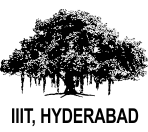

Hi, I'm a Research Scholar at <a href="http://www.nec-labs.com">NEC Laboratories America Inc</a>. My interests lie in the field of computer vision and deep learning especially targeted towards autonomous vehicles. Prior to joining NEC, I worked as a Research Assistant under <a href="https://www.iiit.ac.in/people/faculty/mkrishna/">Prof. K. Madhava Krishna</a> at <a href="https://robotics.iiit.ac.in/">Robotics Research Center</a> on various projects related to autonomous vehicles. I also interned at <a href="https://www.iiitd.ac.in">IIIT Delhi</a> during my summer 2017 where I worked extensively on planning and perception of an autonomous car project.

<b>News</b>

* Our work on language conditioned autonomous navigation for self-driving cars is accepeted at IROS 19.
* Paper on diverse trajectory proposals is accepted at IV 19.

<b>Publications</b>
  

<table>
  <tr>
    <td width="25%">        </td>
    <td width="70%">  
    <strong> Talk to the Vehicle: Language Conditioned Autonomous Navigation of Self Driving Cars</strong>  
     <strong>Sriram N. N.</strong>, Tirth Maniar, Jayaganesh Kalyanasundaram, Vineet Gandhi, Brojeshwar Bhowmick, K Madhava Krishna  
    <strong> IROS 19 [Accepted] </strong> &nbsp; 
    </td> 
  </tr>
</table>

<table>
  <tr>
    <td width="25%">        </td>
    <td width="70%">    <a href="https://arxiv.org/pdf/1906.03584.pdf"> 
    <strong> A Hierarchical Network for Diverse Trajectory Proposals </strong> </a>   
    <strong>Sriram N. N.</strong>, Gourav Kumar, Abhay Singh, M. Siva Karthik, Saket Saurav, Brojeshwar Bhowmick, K. Madhava Krishna  
    <strong> IV 19 </strong> <a class="paper" href="https://arxiv.org/pdf/1906.03584.pdf"> Paper </a> 
    <a class="video" href="https://www.youtube.com/watch?v=cvq2dFS-dZo"> Video </a> &nbsp; 
    </td> 
  </tr>
</table>

<table>
  <tr>
    <td width="25%">        </td>
    <td width="70%">    <a href="https://arxiv.org/pdf/1804.08679.pdf"> 
    <strong> Gradient Aware - Shrinking Domain based Control Design for Reactive Planning Frameworks used in Autonomous Vehicles </strong> </a>   
     Adarsh Modh, Siddharth Singh, A. V. S. Sai Bhargav Kumar, <strong>Sriram N. N.</strong>, K. Madhava Krishna  
    <strong> AIR 19 </strong> <a class="paper" href="https://arxiv.org/pdf/1804.08679.pdf"> Paper </a> <a class="video" href="https://www.youtube.com/watch?v=Yf4F0dvkwQE"> Video </a> &nbsp; 
    </td> 
  </tr>
</table>

<!-- 

<b>I am privileged to be associated with the following</b>

<table text-align="center">
<tr><td align="center"></td> <td align="center"></td>  <td align="center"></td>  <td align="center"></td>  <td align="center"></td> </tr>

<tr><td align="center">PhD</td><td align="center">Bachelor's &amp; Master's</td><td align="center">Intern</td><td align="center"> Intern</td><td align="center">Intern</td></tr>
</table>

 -->

